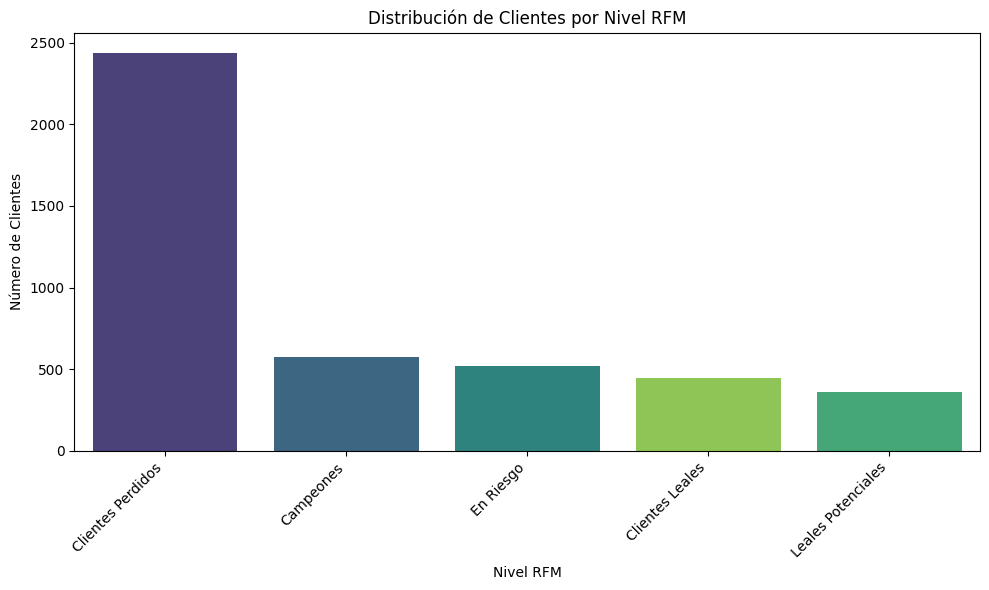
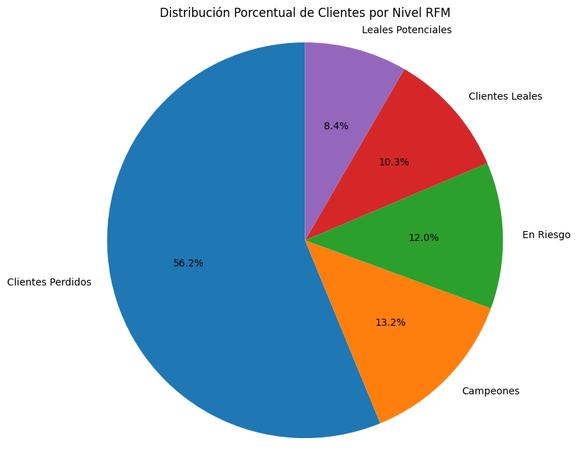
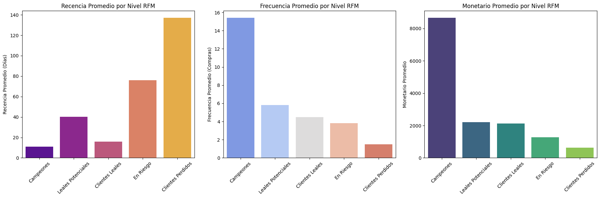
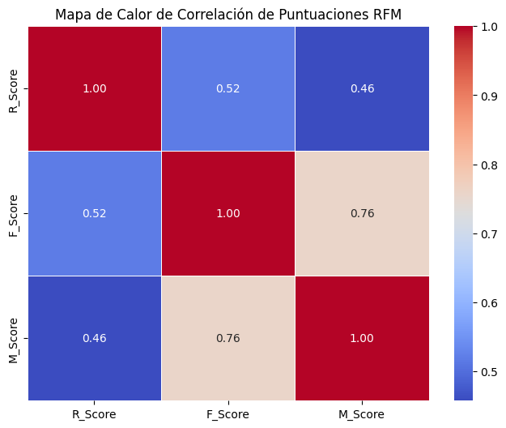
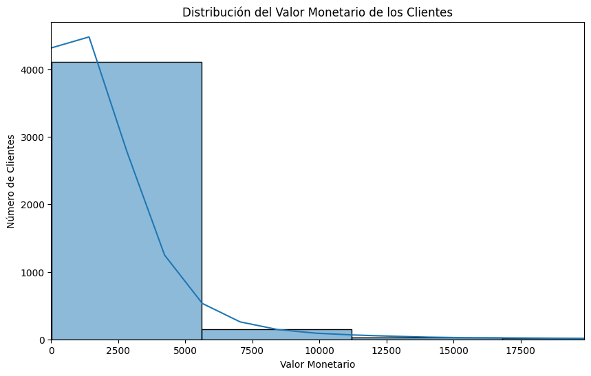
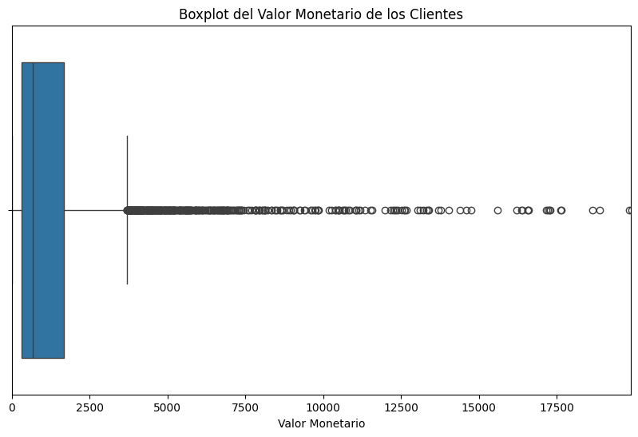
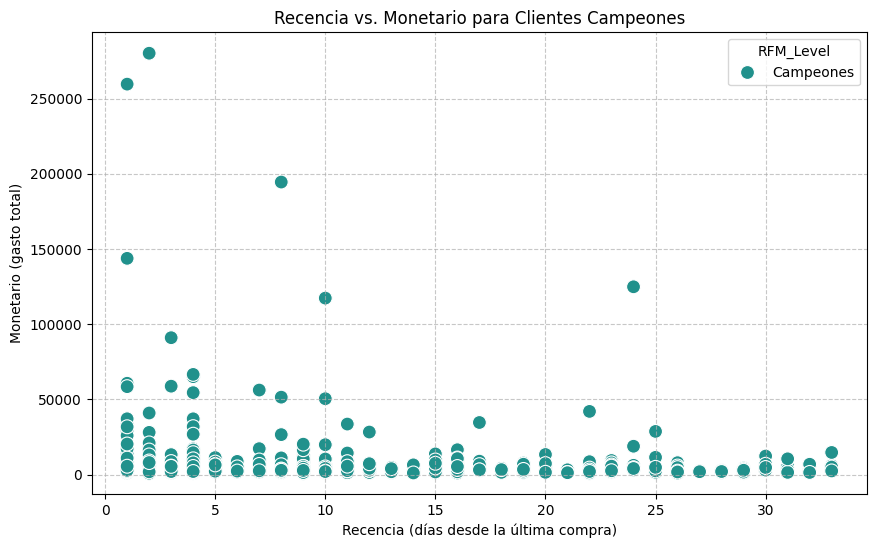
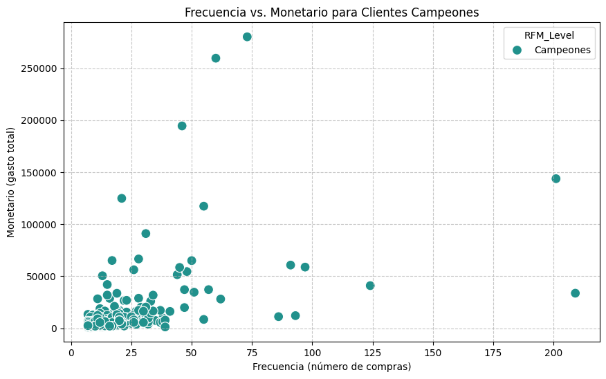
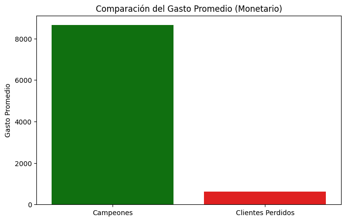

# 📊 Segmentación de Clientes con Análisis RFM

## 📌 Descripción del Dataset

El dataset utilizado corresponde a transacciones comerciales de clientes de una tienda retail, incluyendo información sobre compras, productos y valores monetarios.

### 🔹 Variables principales:
- InvoiceNo: Número de factura  
- StockCode: Código del producto  
- Description: Descripción del producto  
- Quantity: Cantidad comprada  
- InvoiceDate: Fecha de la transacción  
- UnitPrice: Precio unitario  
- CustomerID: Identificador del cliente  
- Country: País  

### 📊 Dimensión del dataset:
- Registros originales: 541,909
- Registros después de limpieza: 397,884

### ⚠️ Problemas detectados:
- 135,080 valores nulos en CustomerID
- Valores nulos en Description
- InvoiceDate en formato incorrecto
- Valores inválidos en Quantity y UnitPrice

---

## 📥 Carga y Exploración Inicial de Datos

### 🔹 Librerías

```python
import numpy as np
import pandas as pd
import matplotlib.pyplot as plt
import seaborn as sns
```

### 🔹 Carga

```python
customerData = pd.read_csv('Analytical Customer Segmentation Analysis.csv', encoding='latin1')
```

### 🔹 Exploración

```python
customerData.head()
customerData.info()
customerData.isnull().sum()
```

---

## ⚙️ Limpieza y Tratamiento de Datos

### 🔹 Eliminación de nulos

```python
customerData.dropna(subset=['CustomerID', 'Description'], inplace=True)
```

### 🔹 Eliminación de valores inválidos

```python
customerData = customerData[customerData['Quantity'] > 0]
customerData = customerData[customerData['UnitPrice'] > 0]
```

### 🔹 Conversión de tipos

```python
customerData['InvoiceDate'] = pd.to_datetime(customerData['InvoiceDate'], dayfirst=True)
customerData['CustomerID'] = customerData['CustomerID'].astype(int)
```

### 🔹 Nueva variable

```python
customerData['TotalPrice'] = customerData['Quantity'] * customerData['UnitPrice']
```

---

## 🧠 Metodología RFM

- Recencia: días desde última compra  
- Frecuencia: número de compras  
- Monetario: gasto total  

Fecha de referencia: 2011-12-10

---

## 📊 Resultados Visuales

<p align="center">
  
</p>

<p align="center">
  
</p>

<p align="center">
  
</p>

<p align="center">
  
</p>

<p align="center">
  
</p>

<p align="center">
  
</p>

<p align="center">
  
</p>

<p align="center">
  
</p>

<p align="center">
  
</p>
---

## 🔍 Hallazgos

- Alta cantidad de clientes perdidos  
- Clientes campeones generan mayor ingreso  
- Relación directa entre frecuencia y gasto  

---

## 🤖 Modelo Predictivo

- MAE: 2033.84  
- R²: 0.07  

---

## 💡 Conclusiones

El análisis RFM ha permitido una segmentación clara de la base de clientes en función de su comportamiento de compra, revelando insights valiosos para la toma de decisiones estratégicas.

### 🔹 Estrategias por segmento

- 🟢 **Campeones:**  
  Son el activo más valioso de la empresa. Se recomienda implementar programas de lealtad exclusivos, reconocimiento especial y comunicación personalizada para mantener su compromiso.

- 🔵 **Clientes Leales y Leales Potenciales:**  
  Presentan un buen historial de compra. Se pueden fomentar compras adicionales mediante ofertas exclusivas, lanzamiento de nuevos productos y encuestas para conocer mejor sus preferencias.

- 🟠 **En Riesgo:**  
  Son clientes cuya actividad ha disminuido. Es fundamental implementar campañas de reactivación con incentivos atractivos (descuentos, promociones personalizadas) y estrategias de comunicación dirigidas.

- 🔴 **Clientes Perdidos:**  
  Han dejado de comprar hace tiempo. Se recomienda aplicar estrategias de recuperación con ofertas de alto valor o campañas de re-engagement enfocadas en nuevos productos o beneficios.

---

### 📈 Impacto esperado

La implementación de estas estrategias personalizadas, basadas en los perfiles RFM, permitirá:

- Optimizar los recursos de marketing  
- Mejorar la retención de clientes  
- Incrementar el valor de vida del cliente (LTV)  

---

## 👥 Autores

Grupo 5 - Tratamiento de Datos

- Sixto Encalada  
- Jimmy Anzules  
- Yordhan Guerron  

---

## 📁 Estructura

.
├── G5-AnalisisDatos-EDA.ipynb
├── Analytical Customer Segmentation Analysis(in).csv
├── rfm_segmentation_report.csv
├── imagenes/
└── README.md
